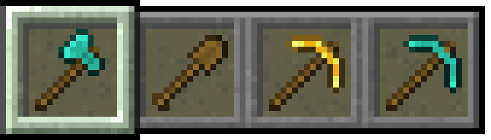

# Last Weapons
Supported language: [한국어 (대한민국)](README.md), [English (US)](README-en_US.md)
- Shows the weapons and armor you had when you won the game.

# Config
- Enable Mod: Enable or disable Last Weapons.
- Language: The language for this mod.
- Display Armors: Displays armors in Last Weapons.
- Display Weapons Level: Displays weapons level in Last Weapons.
- Display Cooled Down Skill: Displays a cooled down skill in Last Weapons.

# Others
- Supports automatic updates for Windows only, limited to the recommended version.
- Cannot be used with Zombies Addon.

# Version system
- Version consists of x.y.z (recommended version) or x.y.z-typew (latest version).
- x means mandatory update. For example, if 2.0.0 is the latest version, then the versions below it cannot be used.
- Version types are Alpha, Beta, Pre-Release (pre), and Release Candidate (rc) in order from the lowest version.
- Alpha is a closed beta version that includes features under development.
- Beta is a public beta version that may have serious bugs.
- Pre-Release is a version that has completed adding features, and bugs may occur.
- Release Candidate is a version that has most bugs fixed, and if no more bugs occur, it will be changed to a recommended version.

# License
This project is licensed under the MIT License as specified in the [LICENSE](LICENSE) file. 
It allows for personal use, modification, distribution, and commercial use under the license and copyright notice, and it comes with no warranty or liability.

# Credits
- [Architectury Pack200](https://github.com/architectury/architectury-pack200) by architectury ([GNU General Public License v2.0 with Classpath Exception](https://github.com/architectury/architectury-pack200/blob/master/LICENSE))
- [DevAuth](https://github.com/DJtheRedstoner/DevAuth) by DJtheRedstoner ([MIT License](https://github.com/DJtheRedstoner/DevAuth/blob/master/LICENSE))
- [Essential Loom](https://github.com/EssentialGG/architectury-loom) by EssentialGG ([MIT License](https://github.com/EssentialGG/architectury-loom/blob/dev/1.6/LICENSE))
- [Gson](https://github.com/google/gson) by google ([Apache License 2.0](https://github.com/google/gson/blob/main/LICENSE))
- [Kotlin](https://github.com/JetBrains/kotlin) by JetBrains ([Apache License 2.0](https://github.com/JetBrains/kotlin/blob/master/license/LICENSE.txt))
- [Mixin](https://github.com/SpongePowered/Mixin) by SpongePowered ([MIT License](https://github.com/SpongePowered/Mixin/blob/master/LICENSE.txt))

****

# Update Log

## 1.2.5
- Added translation.

## 1.2.4
- Fixed bugs.
- Fixed mod deleter.

## 1.2.3
- Fixed bugs.

## 1.2.2
- Fixed bugs.

## 1.2.1
- Fixed bugs.

## 1.2.0
- Fixed update checker.
- Fixed bugs.

## 1.1.0
- Added config.
- Changed java to kotlin.

## 1.0.1
- Fixed bugs.

## 1.0.0
- I made this mod.