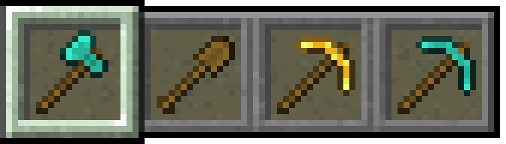

# Last Weapons
지원 언어: [한국어 (대한민국)](README.md), [English (US)](README-en_US.md)
- 게임에서 승리했을 때 가지고 있던 무기와 갑옷을 보여줍니다.

# 컨피그
- 모드 활성화: Last Weapons를 활성화 또는 비활성화합니다.
- 언어: 이 모드에서 사용할 언어입니다.
- 갑옷 표시: Last Weapons에서 갑옷을 표시합니다.
- 무기 레벨 표시: Last Weapons에서 무기 레벨을 표시합니다.
- 쿨다운된 스킬 표시: Last Weapons에서 쿨다운된 스킬을 표시합니다.

# 기타
- 추천 버전에 한에 윈도우 전용 자동 업데이트를 지원합니다.
- Zombies Addon과 같이 사용될 수 없습니다.

# 버전 체계
- 버전은 x.y.z(추천 버전) 또는 x.y.z-타입w(최신 버전)으로 구성됩니다.
- x는 필수 업데이트를 의미합니다. 예를 들어 2.0.0 버전이 최신 버전이라면 그 아래의 버전은 사용할 수 없습니다.
- 버전 타입은 낮은 버전 부터 차례대로 Alpha, Beta, Pre-Release(pre), Release Candidate(rc)가 있습니다.
- Alpha는 비공개 테스트 버전으로, 개발 중인 기능이 포함되어 있습니다.
- Beta는 공개 테스트 버전으로, 심각한 버그가 발생할 수 있습니다.
- Pre-Release는 기능 추가이 완료된 버전으로, 버그가 발생할 수 있습니다.
- Release Candidate는 대부분의 버그가 수정된 버전으로, 더 이상 버그가 발생하지 않는다면 추천 버전으로 변경됩니다.

# 라이선스
이 프로젝트는 [LICENSE](LICENSE) 파일의 전문에 따라 MIT 허가서가 적용됩니다. 
라이선스 및 저작권 고지 하에 개인적 이용, 수정, 배포, 상업적 이용이 가능하며 보증 및 책임을 지지 않습니다.

# 크레딧
- architectury의 [Architectury Pack200](https://github.com/architectury/architectury-pack200) ([Classpath Exception을 포함한 GNU 일반 공중 사용 허가서 v2.0](https://github.com/architectury/architectury-pack200/blob/master/LICENSE))
- DJtheRedstoner의 [DevAuth](https://github.com/DJtheRedstoner/DevAuth) ([MIT 허가서](https://github.com/DJtheRedstoner/DevAuth/blob/master/LICENSE))
- EssentialGG의 [Essential Loom](https://github.com/EssentialGG/architectury-loom) ([MIT 허가서](https://github.com/EssentialGG/architectury-loom/blob/dev/1.6/LICENSE))
- google의 [Gson](https://github.com/google/gson) ([아파치 라이선스 2.0](https://github.com/google/gson/blob/main/LICENSE))
- JetBrains의 [Kotlin](https://github.com/JetBrains/kotlin) ([아파치 라이선스 2.0](https://github.com/JetBrains/kotlin/blob/master/license/LICENSE.txt))
- SpongePowered의 [Mixin](https://github.com/SpongePowered/Mixin) ([MIT 허가서](https://github.com/SpongePowered/Mixin/blob/master/LICENSE.txt))

****

# 업데이트 로그

## 1.2.5
- 번역 추가.

## 1.2.4
- 버그 수정.
- 모드 삭제기 수정.

## 1.2.3
- 버그 수정.

## 1.2.2
- 버그 수정.

## 1.2.2
- 버그 수정.

## 1.2.1
- 버그 수정.

## 1.2.0
- 업데이트 확인 수정.
- 버그 수정.

## 1.1.0
- 컨피그 추가.
- java를 kotlin으로 변경.

## 1.0.1
- 버그 수정.

## 1.0.0
- 모드 개발.